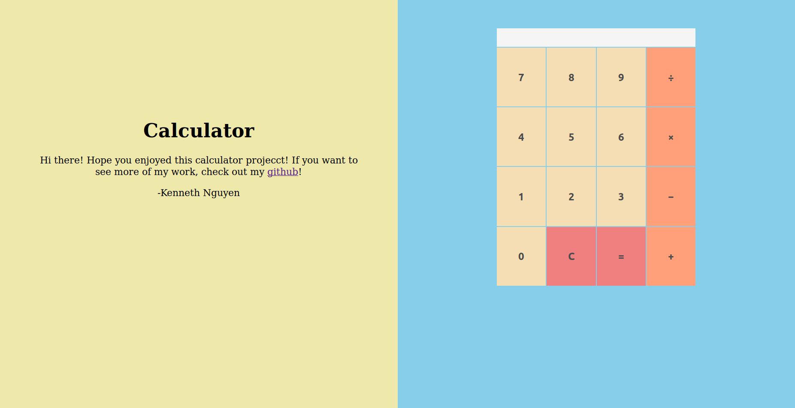

# Calculator

Demo: http://kennethnguyen.github.io/calculator

## Screenshot (As of October 8, 2019)

## Description

A browser four function calculator. Currently the calculator is only able to calculate operations for single digit inputs. 

Inspired by [The Odin Project's Web Development 101](https://www.theodinproject.com/courses/web-development-101/lessons/calculator)

## Utilized

* HTML | Javascript | CSS

## Todo

* Make calculator functional for multiple digit inputs
* Calculator can make consecutive operational executions without having to press the equal (=) button each time
* Negative inputs and decimal inputs

## Author

Kenneth Nguyen
